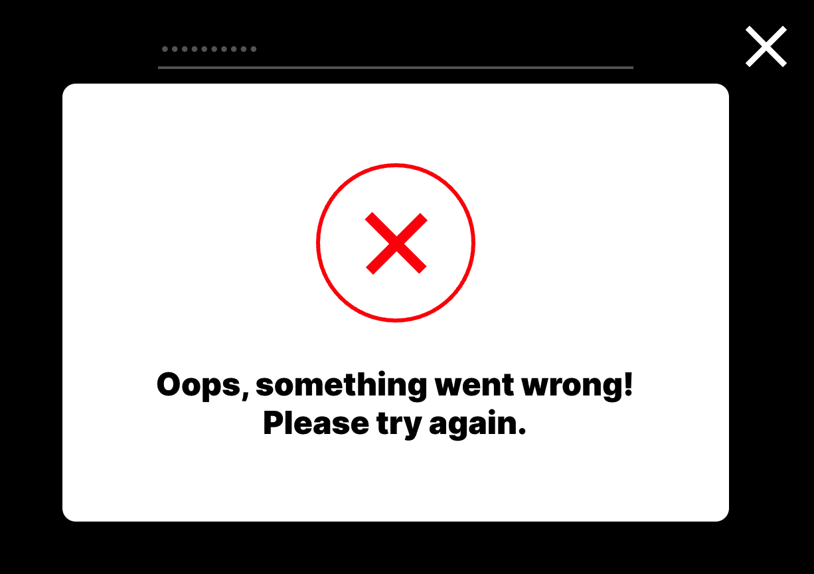

# Around the U.S.
*Around the U.S.* is a social media site where users can make an account, edit their profiles, and interact with photos. [You can watch the demo here!](https://www.loom.com/share/d4e0d3b5ecb145a9a897f135fe692965)
  
[around-the-us.students.nomoreparties.site](https://around-the-us.students.nomoreparties.site) 
[www.around-the-us.students.nomoreparties.site](https://www.around-the-us.students.nomoreparties.site)

---

## Application Features

* the user can create an account an sign in

* if everything goes well, the user will see a confirmation modal

* if there is an issue, the user will see an error modal. Common causes for errors are the email is already registered, the email is not a valid email, the email or password are missing, and the password is too short or too long

* this is an overview of what the application can do

* edit profile section: avatar, name, about me
* add cards by submitting a valid link and name
* here's an example of what a modal looks like. They all look pretty similar, this is the add card modal

* delete cards (users can only delete cards they created, see overview)
* like cards (see overview)
* clicking the card photo enlarges the photo via a modal. Here's what that looks like

* modals can be closed by pressing escape, clicking outside of the overlay of the modal, or by clicking the X icon in the top right corner
* users will remain signed in when they close the app in one tab then open the app in another tab (JSON web tokens and localStorage)
* responsive design

---
## Technologies and Libraries
MongoDB - Express.js - React - Node.js
* functional components, hooks (state, context, effects), navigation
* CSS: makes everything look sharp and behave responsively
* JSON web tokens: simplifies the authentication process
* celebrate: inbound data validation
* mongoose: allows JavaScript to work with our database (MongoDB)
* bcrypt: protects passwords with hashes and a 10 character salt
* middlewares: express request limiter, request and error logging with winston/express-winston, enabling CORS, authorization, HTTP headers with helmut

---

## Deployment
*Around the U.S.* is deployed with Google Cloud. It features HTTPS protocol via SSL certificates and redirects requests using NGINX. The app can be viewed at:  
[around-the-us.students.nomoreparties.site](https://around-the-us.students.nomoreparties.site) 
[www.around-the-us.students.nomoreparties.site](https://www.around-the-us.students.nomoreparties.site)

---

## Getting started - development
1. copy the repository on your machine
2. run 'npm i' from the frontend and backend directory
3. run 'npm run dev' from to launch the backend
4. run 'npm run start' from to launch the frontend
5. that's it. have fun!!

